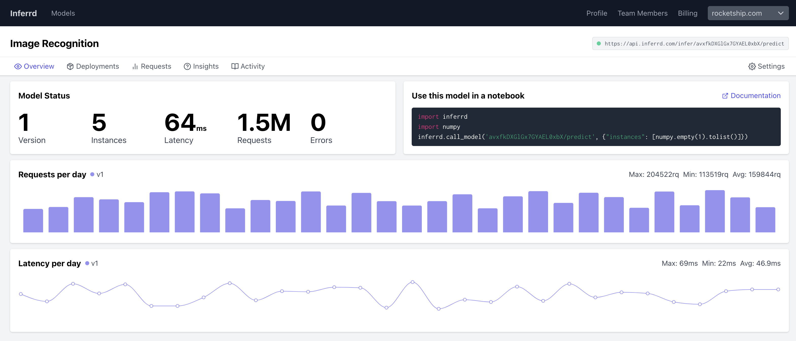

## Introduction

[](https://GitHub.com/inferrd/inferrd/stargazers/) [](https://github.com/inferrd/inferrd/tree/main/LICENSE)


**ML Deployment made simple, scalable and collaborative**  
The new open-source standard to deploy, monitor and secure Machine Learning services.



Inferrd is on a mission to make machine learning deployment a breeze.

* **Maintenance-free environments**. Just drag and drop your models, and get an API.
* **Your data stays in your cloud**. Have full control over where you send your data, and how it's processed.
* **No more security compliance process** to go through as Inferrd is self-hosted. 
* **No more pricing indexed on volume**, as cloud-based solutions offer. 

## Quick start

Inferrd can be installed by clone this repo and docker.

Make sure `docker` is installed on your inference server. Then create a `.env` file that contains your AWS S3 keys & host name (it will be used to store your models).

Then run the two following commands to get started:

```
git clone https://github.com/inferrd/inferrd.git
cd inferrd
docker-compose up
```

Now visit [http://localhost:8080](http://localhost:8080) and login with email `admin` and password `admin`.

## Features

* **Deploy form notebook**: Use the [Inferrd SDK](https://github.com/inferrd/sdk) to deploy from your notebook.
* **Wide framework support**: Deploy TensorFlow, PyTorch, HuggingFace, ONNX, Scikit and XGBoost hassle free.
* **GPU support**: GPU acceleration comes pre-configured out of the box.
* **Monitoring**: Monitoring is available as soon as you make your first request. Prometheus monitoring is also available.
* **Versioning**: Keep track of all the versions you deploy and rollback anytime.
* **Request logging**: Inspect all requests coming into your model.

## Community support

For general help using Inferrd, please refer to the official Inferrd documentation. For additional help, you can use one of these channels to ask a question:

* [Discord](https://discord.gg/EequCErc6s) \(For live discussion with the Community and Inferrd team\)

## Entreprise Edition

Are you looking for support and more advanced features such as RBAC, AutoScale, Multi-node deployments and A/B testing? [Contact us](mailto:theo@inferrd.com).